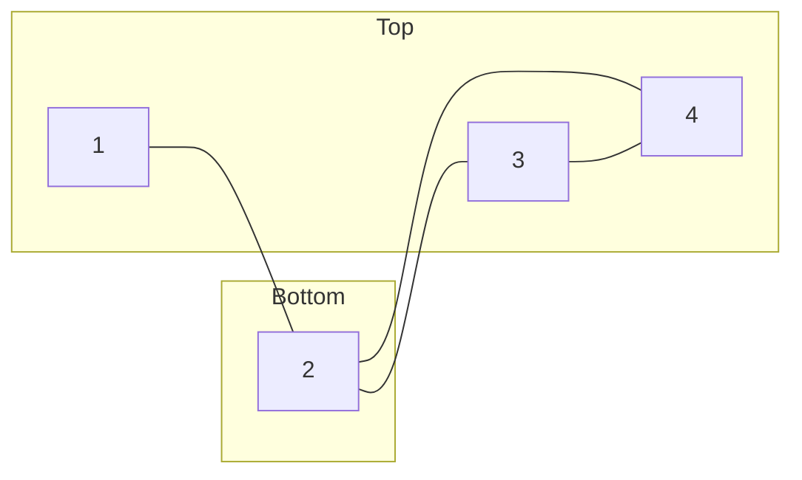

# How can we go about solving for the max cut?
Asking this question, implies there is some way of scoring different cuts, where some cuts are "better" than other cuts. Let us define the "score" (or "cost") of a cut in the following way:[^1]

[^1]: (https://arxiv.org/pdf/1501.07030.pdf)

$$
C(\mathbf{s}) = \sum_{i<j} w_{ij} (1-s_is_j)/2 = C - \frac{1}{2}\sum_{i<j}w_{ij}s_is_j
$$

where $s_i = 1$ when site $i$ is in the `top`, and $s_i=-1$ if site $i$ is in the `bottom`

for example:

Here, the cut would be denoted as `s = (1, -1, 1, 1)`, and 
the cost function would be: `C(1,-1,1,1) = 3`. This is larger than another cut, `C(1,1,-1,1)=2`.

From here, we see that maximizing the cost function `C`, is equivalent to finding the lowest energy spin configuration of the Ising spin model:

$$
\hat{H} = \sum_{i<j}J_{ij}s_is_j.
$$

# Quantum Solution

How do we encode this into a quantum computer. First we need a way to denote spin. Since our spin (or bipartition assignment) assumes one of two distinct values, we could use a Hermitian operator that has two distinct eigenvalues. How about this one?:

$$
\hat{Z} = \begin{pmatrix}1 & 0\\0 & -1\end{pmatrix}.
$$

Since this has one of two options, we can replace $s_i$ in the Hamiltonian with this $Z$ Pauli operator:

$$
\hat{H} = \sum_{i<j}J_{ij}\hat{Z}_i\hat{Z}_j, 
$$
where we note that the fact that the Z matrices act on distinct sites. This means, that when $i\neq j$, $\hat{Z}_i\hat{Z}_j = \hat{Z}_i\otimes\hat{Z}_j$. As such, our cost function is now directly associated with a Hamiltonian. By extension, the `cut` will now be specified by a wavefunction:

$$
\begin{align}
\ket{\psi} &= \ket{\psi_1}\otimes \ket{\psi_2}\otimes\ket{\psi_3}\otimes\ket{\psi_4}\\
&=\ket{\psi_1}\ket{\psi_2}\ket{\psi_3}\ket{\psi_4}\\
&=\ket{\psi_1\psi_2\psi_3\psi_4}
\end{align}
$$

If $\ket{\psi_i}=\ket{0}$, then $\hat{Z}_i\ket{\psi_i} = 1\ket{\psi_i}$. Similarly, if $\ket{\psi_i}=\ket{1}$, then $\hat{Z}_i\ket{\psi_i} = -1\ket{\psi_i}$. 

[Up](README.md)