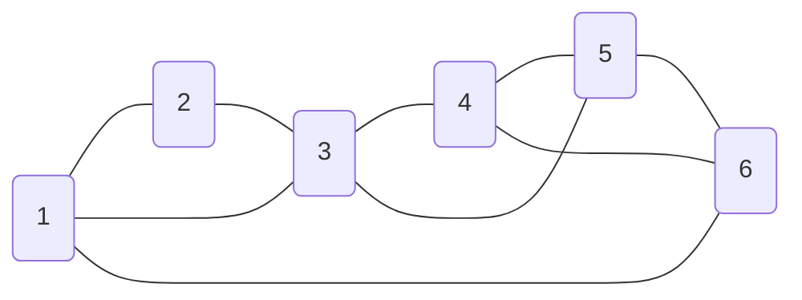
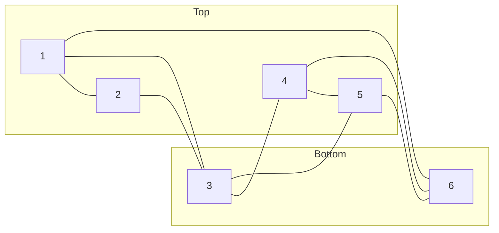
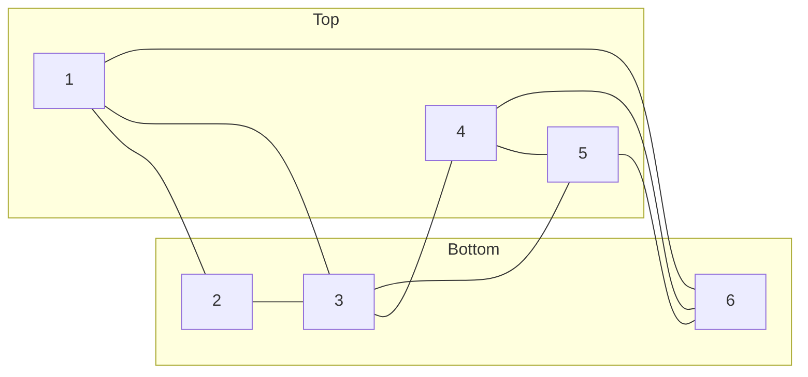

### 6-Node example
Consider the following graph of 6 nodes. We want to partition this into two groups, a `Top` and a `Bottom`:

The following cut breaks 7 edges:

However, this is not unique, we could have also achieved an equally good cut by just adding node `2` to `R`:

As such, there are generally multiple solutions that are equally good. In a quantum mechanical context, we refer to this as [degeneracy](https://en.wikipedia.org/wiki/Degenerate_energy_levels).

[Up](./README.md)